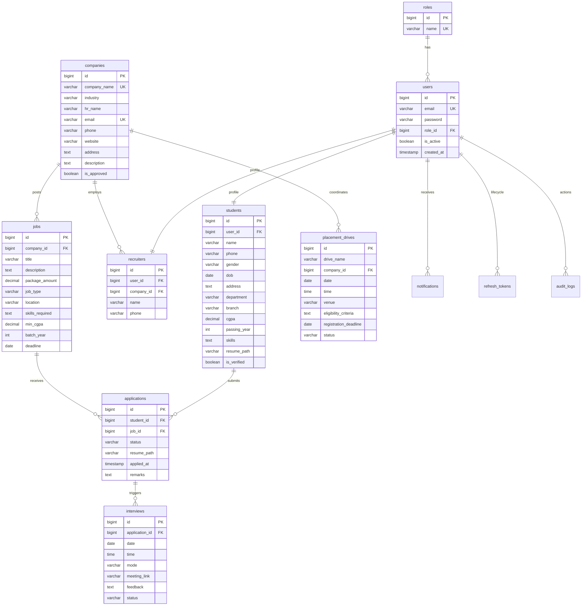
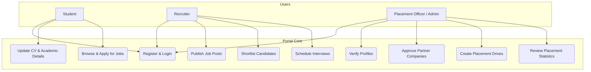
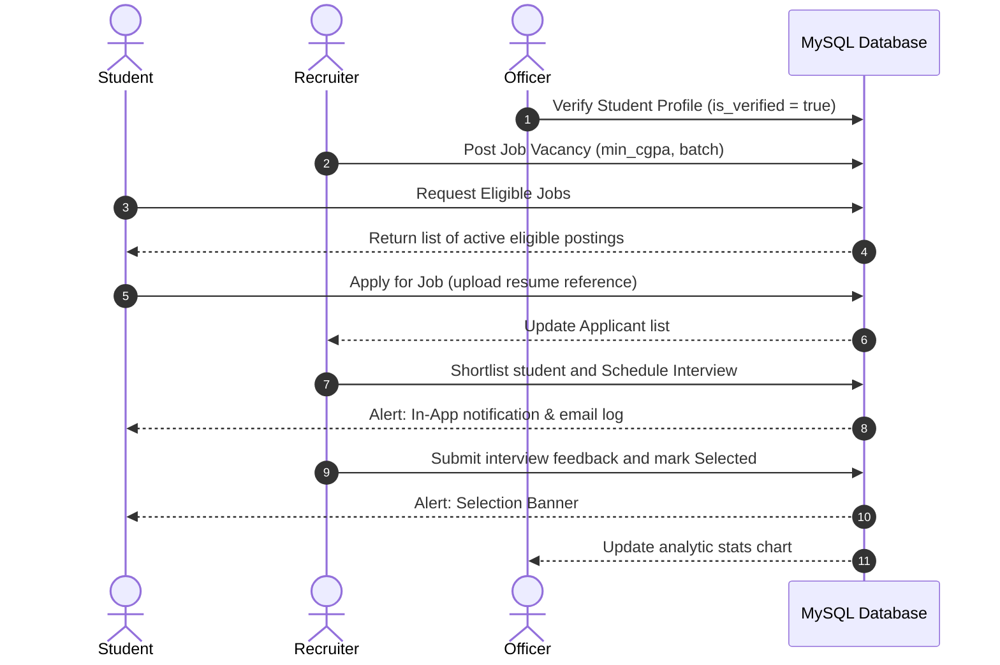

# Campus Placement Management System

An enterprise-grade, role-based platform designed to coordinate and streamline college placements. Connecting **Students**, **Placement Officers/Admins**, and **Corporate Recruiters** in a single ecosystem.

---

## 🚀 Tech Stack

- **Frontend**: React 19, Vite, React Router DOM, Axios, Tailwind CSS, Recharts, Lucide Icons.
- **Backend**: Java 21, Spring Boot 3.3.x, Spring Security (JWT), Spring Data JPA, Hibernate, Lombok, Maven.
- **Database**: MySQL 8.
- **API Documentation**: Swagger UI, Postman Collection.

---

## 📂 Project Structure

```text
Placement_mgt_project/
├── backend/
│   ├── src/
│   │   ├── main/
│   │   │   ├── java/com/placement/mgt/
│   │   │   │   ├── config/          # SecurityConfig, JwtService, JwtFilter, WebConfig, Swagger
│   │   │   │   ├── controller/      # AuthController, StudentController, RecruiterController, OfficerController
│   │   │   │   ├── dto/             # LoginRequest, RegisterRequest, StudentProfileDto, DashboardStatsDto, etc.
│   │   │   │   ├── entity/          # User, Role, Student, Recruiter, Company, Job, Application, etc.
│   │   │   │   ├── exception/       # ResourceNotFoundException, GlobalExceptionHandler
│   │   │   │   ├── repository/      # UserRepository, JobRepository, ApplicationRepository, etc.
│   │   │   │   └── service/         # AuthService, ProfileService, JobService, ApplicationService, etc.
│   │   │   └── resources/
│   │   │       └── application.properties
│   │   └── pom.xml                  # Backend dependency manager
├── frontend/
│   ├── src/
│   │   ├── context/                 # AuthContext (authentication provider)
│   │   ├── layouts/                 # DashboardLayout (role sidebars, headers)
│   │   ├── pages/                   # Home, About, Login, Register, Dashboards, Profiles, Jobs, etc.
│   │   ├── routes/                  # ProtectedRoutes, RoleRoute (guards)
│   │   ├── services/                # api.js (Axios client with silent JWT refresh)
│   │   ├── App.jsx                  # Main routing tree
│   │   ├── index.css                # Tailwind directives & design system overrides
│   │   └── main.jsx                 # Entry point renderer
│   ├── tailwind.config.js           # Theme and scanning boundaries
│   ├── postcss.config.js
│   └── package.json                 # Frontend dependencies
├── placement_management.sql         # Database schema & initial roles/users
└── placement_management_postman_collection.json # API endpoints collection
```

---

## 📊 System Diagrams

### 1. Entity Relationship (ER) Diagram



### 2. Use Case Diagram



### 3. Sequence Diagram (Hiring Workflow)



---

## 🛠️ Run & Setup Guide

### 1. Database Setup
1. Open **MySQL Workbench** or command line.
2. Create database `placement_management` (if not created):
   ```sql
   CREATE DATABASE placement_management;
   ```
3. Import the `placement_management.sql` file.

### 2. Backend Setup (Spring Boot)
1. Open the `/backend` folder in **IntelliJ IDEA**.
2. Open `src/main/resources/application.properties`.
3. Update database credentials:
   ```properties
   spring.datasource.username=YOUR_MYSQL_USERNAME
   spring.datasource.password=YOUR_MYSQL_PASSWORD
   ```
4. Run the project by executing the main file `PlacementManagementApplication.java` or executing:
   ```bash
   mvn spring-boot:run
   ```
   *The server runs at `http://localhost:8080`.*
5. API Documentation is served at:
   - **Swagger UI**: `http://localhost:8080/swagger-ui/index.html`

### 3. Frontend Setup (React)
1. Open the `/frontend` folder in **VS Code**.
2. Install package nodes:
   ```bash
   npm install
   ```
3. Launch development server:
   ```bash
   npm run dev
   ```
   *The portal will open at `http://localhost:5173`.*

---

## 🔑 Default Accounts (Seed Data)

The database imports two pre-configured role-based users for testing. Passwords are case-sensitive.

| User Role | Username / Email | Password | Role Capability |
| :--- | :--- | :--- | :--- |
| **Admin** | `admin@placement.com` | `admin123` | Direct verification / Analytics access |
| **Placement Officer** | `officer@placement.com` | `officer123` | Verification / Scheduling Drives |
